
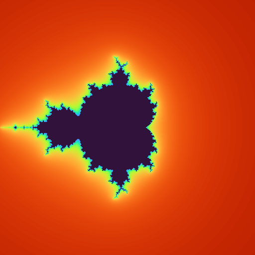
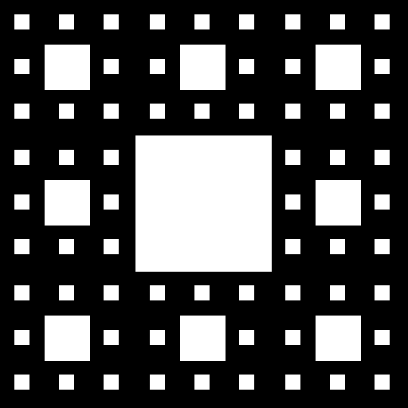

# Fractales

compilation of python scripts for the generation of various fractals.

**Notice:** The documentation is not complete, this collection of scripts is capable of much more than what is specified in this README, such as parallelizing the generation of fractals, different ways of choosing color palettes, ... Review in detail the comand line help.

**A complete documentation is on its way.**

The complete set of options is given by

```bash
usage: main.py [--help] [-o FILENAME] [-im IMAGE MODE] [--size WIDTH HEIGHT] [-w WIDTH] [-h HEIGHT] [-bc COLOR] [-c COLOR] [--show] [-v] [--version] [-x xi xf]
               [-y yi yf] [-pn PALETTE_NAME] [-pnd COLOR [COLOR ...]] [-nw NODES_WEIGHTS [NODES_WEIGHTS ...]] [-i] [--barnsley] [--mandelbrot] [-m MAX_ITERATION]
               [-er ESCAPE_RADIUS] [-s] [-p PROCESS_NUMBER] [--sierpinski]

Generates multiples fractals

optional arguments:
  --help                show this help message and exit

General args:
  -o FILENAME, --output-file FILENAME
                        name of output image. (default: fractal.png)
  -im IMAGE MODE, --image-mode IMAGE MODE
                        mode of the output image. This specify what color schema must be applied. (default: L)
  --size WIDTH HEIGHT   size of output image in pixels. (default: (512, 512))
  -w WIDTH, --width WIDTH
                        width of the output image in pixels. (default: None)
  -h HEIGHT, --height HEIGHT
                        height of the output image in pixels. (default: None)
  -bc COLOR, --background-color COLOR
                        background color of the output image. (default: 0)
  -c COLOR, --color COLOR
                        edit. (default: 255)
  --show                show the image (default: False)
  -v, --verbose
  --version             show program's version number and exit

Geometrical args:
  -x xi xf, --x-interval xi xf
                        interval of visualisation in the X axis (default: (-2, 2))
  -y yi yf, --y-interval yi yf
                        interval of visualisation in the Y axis (default: (-2, 2))

Palette args:
  -pn PALETTE_NAME, --palette-name PALETTE_NAME
                        edit. (default: None)
  -pnd COLOR [COLOR ...], --palette-nodes COLOR [COLOR ...]
                        edit. (default: None)
  -nw NODES_WEIGHTS [NODES_WEIGHTS ...], --nodes-weights NODES_WEIGHTS [NODES_WEIGHTS ...]
                        edit. (default: None)
  -i, --invert-palette  edit. (default: False)

Barnsley args:
  --barnsley            edit. (default: False)

Mandelbrot args:
  --mandelbrot          edit. (default: False)
  -m MAX_ITERATION, --max-iteration MAX_ITERATION
                        maximum iteration. (default: 20)
  -er ESCAPE_RADIUS, --escape-radius ESCAPE_RADIUS
                        edit. (default: 1000)
  -s, --smooth-bands    edit. (default: False)
  -p PROCESS_NUMBER, --process-number PROCESS_NUMBER
                        number of process for the paralelization, if zero is passed the maximum number allowed will be used. (default: 0)

Sierpinkski args:
  --sierpinski          edit. (default: False)
```

## Some Examples
```bash
python main.py --mandelbrot --smooth-bands -pnd black black red -nw 0 0.5 1 -im P
```



```bash
python main.py --mandelbrot --smooth-bands -pn turbo -im P -i
```


```bash
python main.py --sierpinski -m 3
```


```bash
python main.py --barnsley -m 100000 --x-interval -5 5 --y-interval 0 10 -c green -im RGB
```
